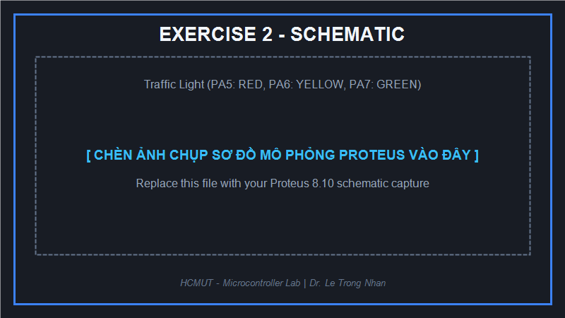
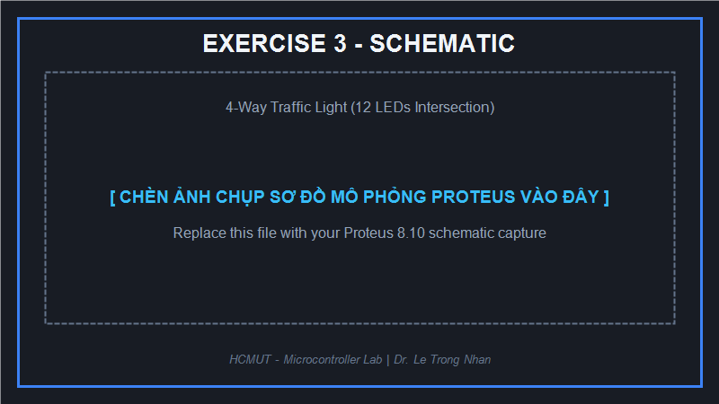
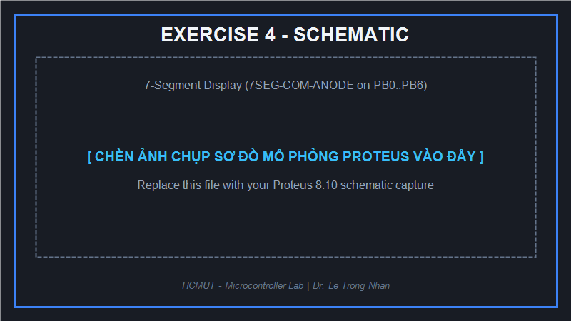
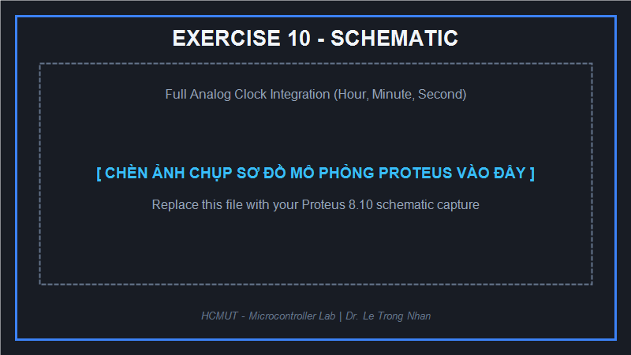

# Lab 1: LED Animations

> Source Exercise 1–10 đã được cài đặt, kèm HEX và kiểm thử tự động.
> Xem [hướng dẫn build và pin mapping](Source_Code/README.md) và
> [kết quả kiểm chứng](Source_Code/VERIFICATION.md). Mô phỏng Proteus chưa được xác nhận hoàn tất.

**Trường Đại học Bách Khoa - ĐHQG TP.HCM (HCMUT - BKU)**  
**Khoa Khoa Học & Kỹ Thuật Máy Tính - Bộ Môn Kỹ Thuật Máy Tính**  
**Môn học**: Vi điều khiển / Thực tập Vi điều khiển  
**Giảng viên phụ trách**: TS. Lê Trọng Nhân  

---

## 📑 Mục Lục
1. [Giới Thiệu & Mục Tiêu](#1-giới-thiệu--mục-tiêu)
2. [Thiết Lập Môi Trường Phát Triển](#2-thiết-lập-môi-trường-phát-triển)
   - [Tạo Project Trên STM32CubeIDE](#21-tạo-project-trên-stm32cubeide)
   - [Mô Phỏng Mạch Trên Proteus](#22-mô-phỏng-mạch-trên-proteus)
3. [Chi Tiết 10 Bài Tập (Exercises) & Sơ Đồ Nguyên Lý](#3-chi-tiết-10-bài-tập-exercises--sơ-đồ-nguyên-lý)
   - [Exercise 1: Chớp Tắt Luân Phiên 2 LED](#exercise-1-chớp-tắt-luân-phiên-2-led)
   - [Exercise 2: Hệ Thống Đèn Giao Thông Đơn](#exercise-2-hệ-thống-đèn-giao-thông-đơn)
   - [Exercise 3: Hệ Thống Đèn Giao Thông 4 Ngã](#exercise-3-hệ-thống-đèn-giao-thông-4-ngã)
   - [Exercise 4: Điều Khiển LED 7 Đoạn Anode Chung](#exercise-4-điều-khiển-led-7-đoạn-anode-chung)
   - [Exercise 5: Đèn Giao Thông Kết Hợp Đếm Ngược LED 7 Đoạn](#exercise-5-đèn-giao-thông-kết-hợp-đếm-ngược-led-7-đoạn)
   - [Exercise 6: Đồng Hồ 12 LED - Kiểm Tra Tuần Tự](#exercise-6-đồng-hồ-12-led---kiểm-tra-tuần-tự)
   - [Exercise 7: Hàm clearAllClock()](#exercise-7-hàm-clearallclock)
   - [Exercise 8: Hàm setNumberOnClock()](#exercise-8-hàm-setnumberonclock)
   - [Exercise 9: Hàm clearNumberOnClock()](#exercise-9-hàm-clearnumberonclock)
   - [Exercise 10: Tích Hợp Đồng Hồ Kim Hoàn Chỉnh](#exercise-10-tích-hợp-đồng-hồ-kim-hoàn-chỉnh)
4. [Tài Liệu Hướng Dẫn Kèm Theo](#4-tài-liệu-hướng-dẫn-kèm-theo)

---

## 1. Giới Thiệu & Mục Tiêu

Lab 1 tập trung vào các kiến thức nền tảng trong lập trình nhúng trên vi điều khiển ARM Cortex-M3 (**STM32F103C6**):
- Sử dụng công cụ **STM32CubeIDE** để khởi tạo vi điều khiển, cấu hình chân GPIO Output và tự động sinh mã nguồn (Hardware Abstraction Layer - HAL).
- Làm quen với các hàm điều khiển GPIO cơ bản: `HAL_GPIO_WritePin`, `HAL_GPIO_TogglePin`, và hàm định thời trễ `HAL_Delay`.
- Nắm vững nguyên lý kết nối phần cứng theo cơ chế **Active LOW** (điều khiển cực âm) đối với LED đơn và LED 7 đoạn Anode chung.
- Xây dựng sơ đồ nguyên lý và kiểm chứng tính đúng đắn thông qua phần mềm mô phỏng mạch **Proteus 8.10 SP0 Professional**.
- Rèn luyện tư duy thiết kế máy trạng thái hữu hạn (FSM) ứng dụng cho hệ thống đèn giao thông và đồng hồ số.

---

## 2. Thiết Lập Môi Trường Phát Triển

### 2.1 Tạo Project Trên STM32CubeIDE
1. Chọn chip **STM32F103C6** (72 MHz, gói LQFP48).
2. Cấu hình các chân điều khiển sang chế độ `GPIO_Output` và đặt nhãn (Label) trực quan (`LED_RED`, `LED_YELLOW`, `LED_GREEN`...).
3. Trong `Properties` -> `C/C++ Build` -> `Settings` -> `MCU Post build outputs`, tích chọn **Convert to Intel Hex file (-O ihex)** để sinh file `.hex`.
4. Xem hướng dẫn chi tiết từng bước tại: [Docs/01_STM32CubeIDE_Setup.md](Docs/01_STM32CubeIDE_Setup.md).

### 2.2 Mô Phỏng Mạch Trên Proteus
1. Lấy chip `STM32F103C6`, các LED hiển thị và điện trở hạn dòng.
2. Nối cực dương LED với nguồn `+3.3V`, cực âm nối vào chân GPIO của STM32.
3. **Lưu ý tối quan trọng**: Bắt buộc phải nối chân `VDDA` vào `+3.3V` và `VSSA` vào `GND` bằng Wire Label trong Proteus để vi điều khiển khởi động bình thường.
4. Nạp file `.hex` từ thư mục `Debug/` vào chip STM32 trong Proteus.
5. Xem hướng dẫn chi tiết tại: [Docs/02_Proteus_Simulation.md](Docs/02_Proteus_Simulation.md).

---

## 3. Chi Tiết 10 Bài Tập (Exercises) & Sơ Đồ Nguyên Lý

Mã nguồn của tất cả 10 bài tập được đặt trong thư mục [`Source_Code/Src/`](Source_Code/Src/) với phần cài đặt hoàn chỉnh. Chọn từng bài và build theo [Source_Code/README.md](Source_Code/README.md).

---

### Exercise 1: Chớp Tắt Luân Phiên 2 LED
- **Mục tiêu**: Đảo trạng thái giữa LED Đỏ (`PA5`) và LED Vàng (`PA6`) mỗi 2 giây (khi Đỏ Sáng thì Vàng Tắt và ngược lại).
- **Mã nguồn**: [`Source_Code/Src/exercise1.c`](Source_Code/Src/exercise1.c)
- **Sơ đồ mạch Proteus**:
  
  

---

### Exercise 2: Hệ Thống Đèn Giao Thông Đơn
- **Mục tiêu**: Mô phỏng hoạt động đèn giao thông đơn làn:
  - LED Đỏ (`PA5`): Sáng trong 5 giây.
  - LED Xanh Lá (`PA7`): Sáng trong 3 giây.
  - LED Vàng (`PA6`): Sáng trong 2 giây.
- **Mã nguồn**: [`Source_Code/Src/exercise2.c`](Source_Code/Src/exercise2.c)
- **Sơ đồ mạch Proteus**:

  

---

### Exercise 3: Hệ Thống Đèn Giao Thông 4 Ngã
- **Mục tiêu**: Sắp xếp 12 LED tạo thành hệ thống đèn giao thông 4 ngã rẽ gồm 2 tuyến đường vuông góc (Hướng 1 & 3: Bắc - Nam; Hướng 2 & 4: Đông - Tây). Khi tuyến này đỏ thì tuyến kia xanh rồi chuyển vàng.
- **Mã nguồn**: [`Source_Code/Src/exercise3.c`](Source_Code/Src/exercise3.c)
- **Sơ đồ mạch Proteus**:

  

---

### Exercise 4: Điều Khiển LED 7 Đoạn Anode Chung
- **Mục tiêu**: Điều khiển linh kiện `7SEG-COM-ANODE` nối vào các chân từ `PB0` đến `PB6` (các thanh `a`, `b`, `c`, `d`, `e`, `f`, `g`). Do là cực dương chung nên xuất mức `0` sẽ sáng thanh LED.
- **Yêu cầu hàm**:
  ```c
  void display7SEG(int num); // num có giá trị từ 0 đến 9
  ```
- **Mã nguồn**: [`Source_Code/Src/exercise4.c`](Source_Code/Src/exercise4.c)
- **Sơ đồ mạch Proteus**:

  

---

### Exercise 5: Đèn Giao Thông Kết Hợp Đếm Ngược LED 7 Đoạn
- **Mục tiêu**: Tích hợp màn hình LED 7 đoạn vào hệ thống đèn giao thông 4 ngã của Exercise 3 để hiển thị số giây đếm ngược còn lại của từng pha đèn. Tái sử dụng hàm `display7SEG()`.
- **Mã nguồn**: [`Source_Code/Src/exercise5.c`](Source_Code/Src/exercise5.c)
- **Sơ đồ mạch Proteus**:

  

---

### Exercise 6: Đồng Hồ 12 LED - Kiểm Tra Tuần Tự
- **Mục tiêu**: Sắp xếp 12 LED thành vòng tròn tượng trưng cho 12 vị trí giờ trên mặt đồng hồ kim, nối vào các chân từ `PA4` đến `PA15`. Viết chương trình bật sáng lần lượt từng LED theo thứ tự để kiểm tra đường truyền phần cứng.
- **Mã nguồn**: [`Source_Code/Src/exercise6.c`](Source_Code/Src/exercise6.c)
- **Sơ đồ mạch Proteus**:

  

---

### Exercise 7: Hàm clearAllClock()
- **Mục tiêu**: Cài đặt hàm tắt đồng thời tất cả 12 LED trên mặt đồng hồ kim (`PA4` - `PA15`):
  ```c
  void clearAllClock(void) {
      // TODO: Tắt toàn bộ 12 LED
  }
  ```
- **Mã nguồn**: [`Source_Code/Src/exercise7.c`](Source_Code/Src/exercise7.c)

---

### Exercise 8: Hàm setNumberOnClock()
- **Mục tiêu**: Bật sáng LED tại vị trí số `num` tương ứng trên mặt đồng hồ (`num` từ `0` đến `11`):
  ```c
  void setNumberOnClock(int num) {
      // TODO: Bật LED tương ứng với vị trí num
  }
  ```
- **Mã nguồn**: [`Source_Code/Src/exercise8.c`](Source_Code/Src/exercise8.c)

---

### Exercise 9: Hàm clearNumberOnClock()
- **Mục tiêu**: Tắt LED tại vị trí số `num` tương ứng trên mặt đồng hồ (`num` từ `0` đến `11`):
  ```c
  void clearNumberOnClock(int num) {
      // TODO: Tắt LED tương ứng với vị trí num
  }
  ```
- **Mã nguồn**: [`Source_Code/Src/exercise9.c`](Source_Code/Src/exercise9.c)

---

### Exercise 10: Tích Hợp Đồng Hồ Kim Hoàn Chỉnh
- **Mục tiêu**: Tích hợp các hàm đã xây dựng để mô phỏng đồng hồ kim chạy thời gian thực trên 12 LED:
  - Có 3 kim: Kim Giờ, Kim Phút, Kim Giây.
  - Ba kim được ánh xạ lên 12 vị trí. Khi các kim trùng vị trí, chúng dùng chung LED nên có **1–3 LED khác nhau** sáng. Không thể vừa hiển thị đúng vị trí kim vừa luôn có đúng 3 LED riêng biệt.
- **Mã nguồn**: [`Source_Code/Src/exercise10.c`](Source_Code/Src/exercise10.c)
- **Sơ đồ mạch Proteus**:

  

---

## 4. Tài Liệu Hướng Dẫn Kèm Theo
- [01_STM32CubeIDE_Setup.md](Docs/01_STM32CubeIDE_Setup.md): Hướng dẫn chi tiết tạo project, cấu hình GPIO và sinh file Hex.
- [02_Proteus_Simulation.md](Docs/02_Proteus_Simulation.md): Hướng dẫn vẽ sơ đồ nguyên lý, kết nối nguồn và nạp mô phỏng.
- [03_Report_Guide.md](Docs/03_Report_Guide.md): Hướng dẫn trình bày báo cáo Report 1 và Report 2 nộp cho Thầy.
